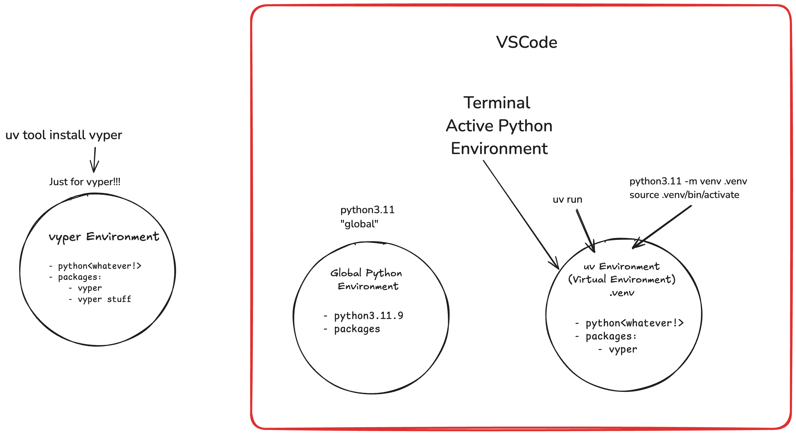
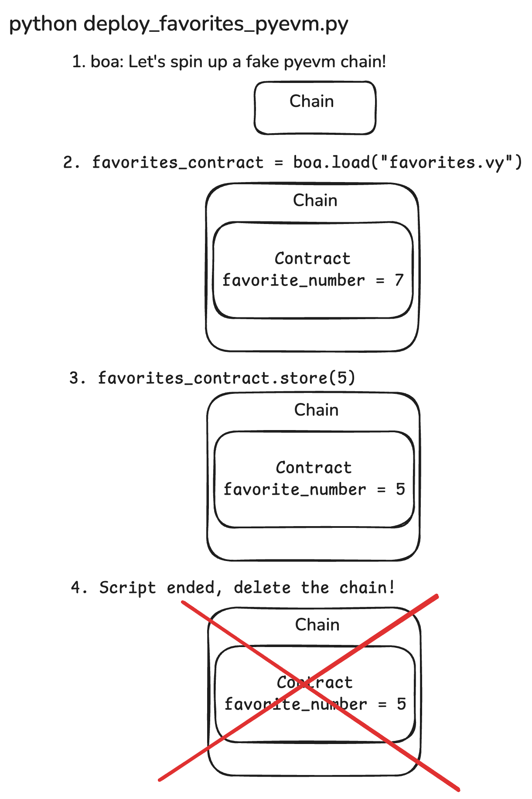
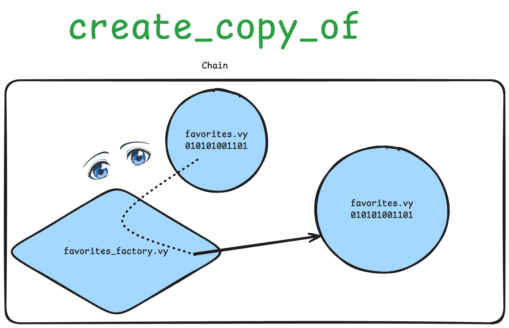
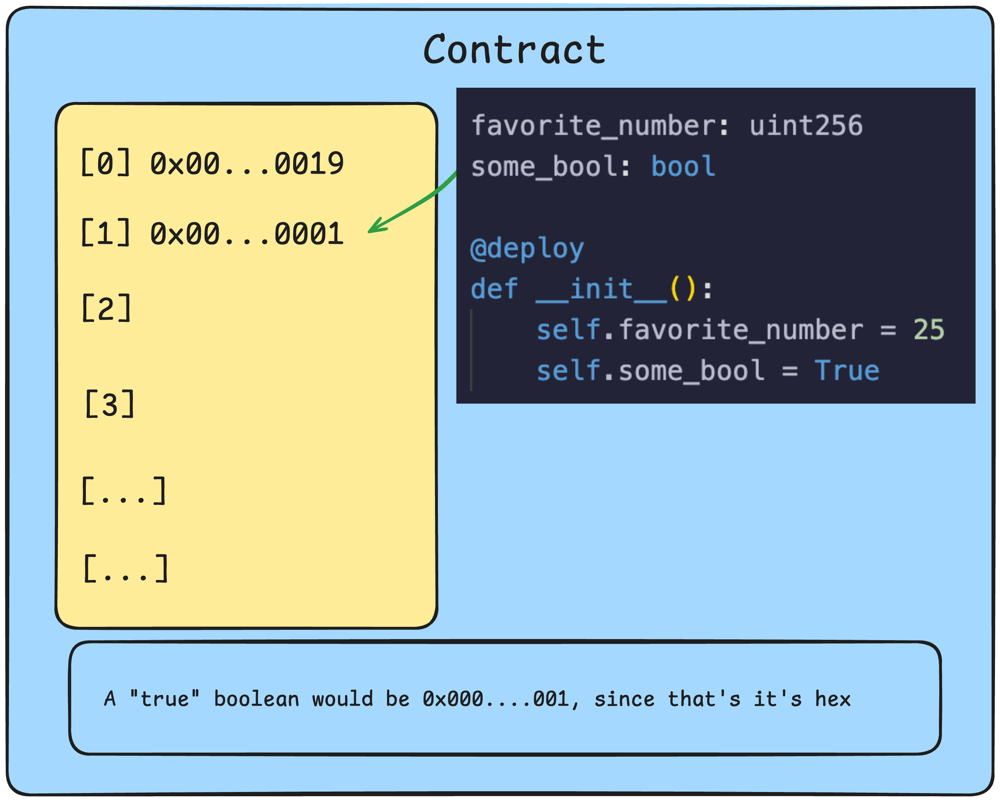
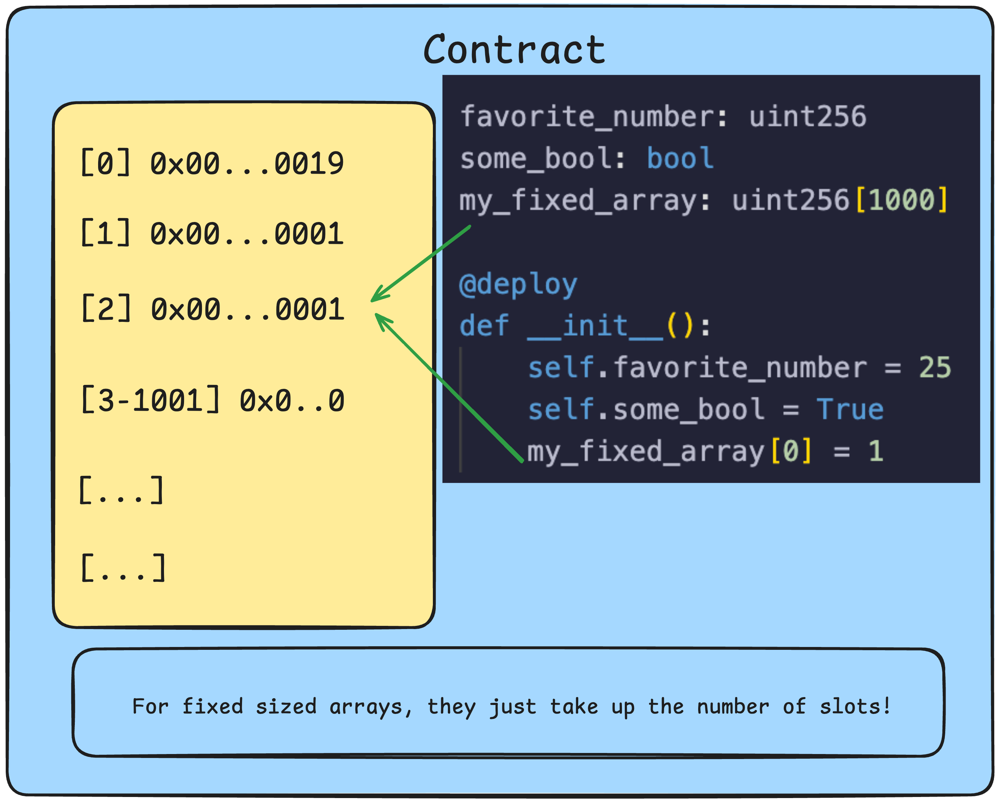
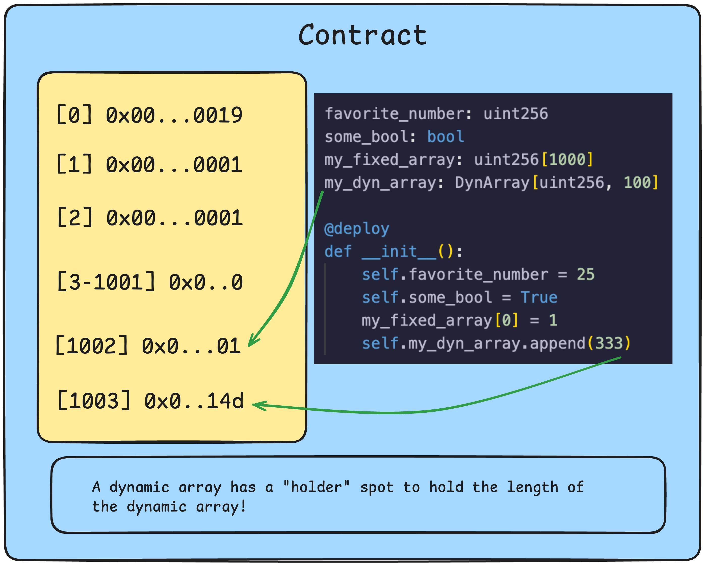
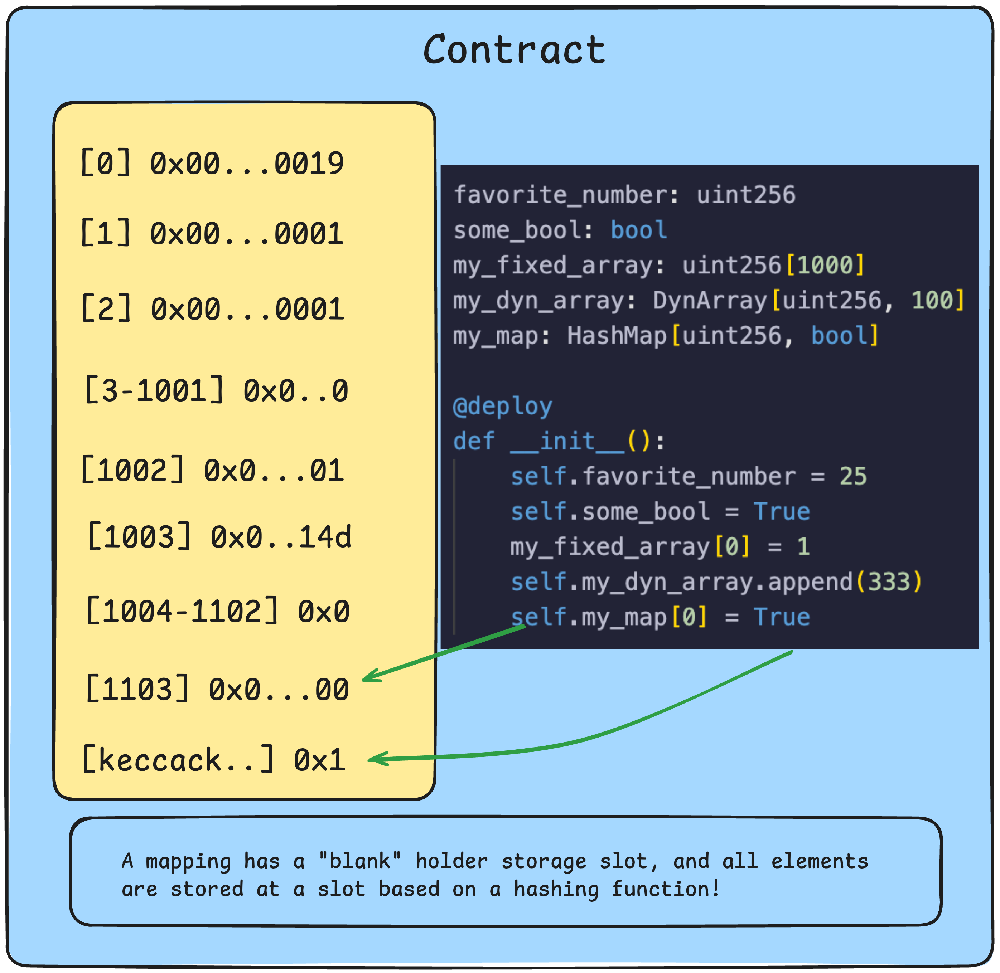
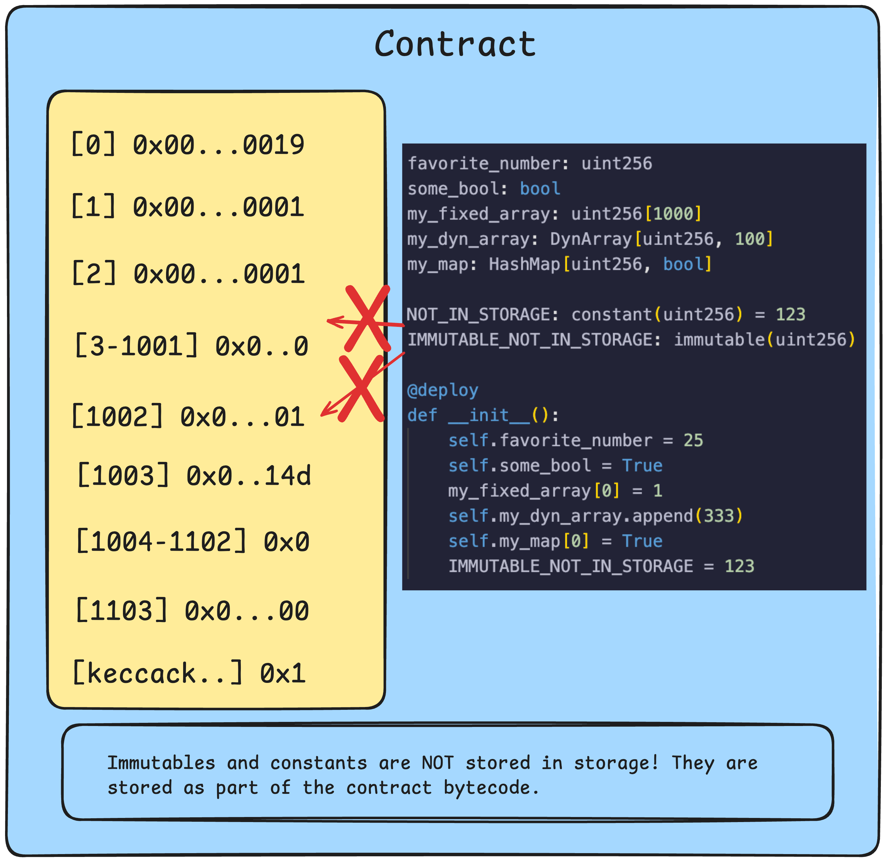
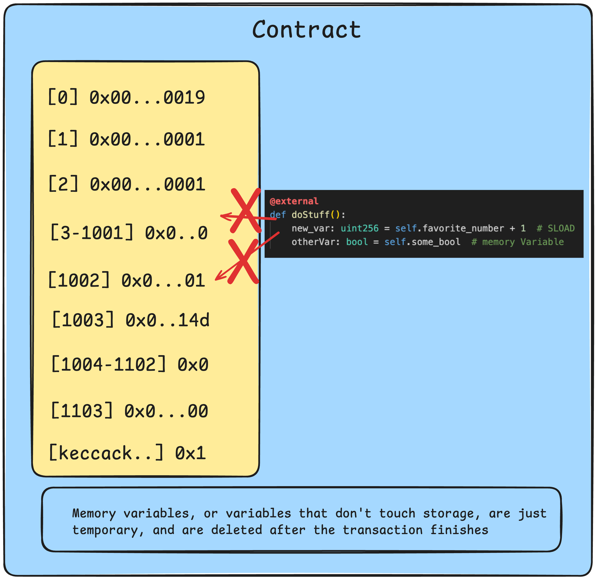

[contributors-shield]: https://img.shields.io/github/contributors/cyfrin/moccasin-full-course-cu.svg?style=for-the-badge
[contributors-url]: https://github.com/cyfrin/moccasin-full-course-cu/graphs/contributors
[forks-shield]: https://img.shields.io/github/forks/cyfrin/moccasin-full-course-cu.svg?style=for-the-badge
[forks-url]: https://github.com/cyfrin/moccasin-full-course-cu/network/members
[stars-shield]: https://img.shields.io/github/stars/cyfrin/moccasin-full-course-cu.svg?style=for-the-badge
[stars-url]: https://github.com/cyfrin/moccasin-full-course-cu/stargazers
[issues-shield]: https://img.shields.io/github/issues/cyfrin/moccasin-full-course-cu.svg?style=for-the-badge
[issues-url]: https://github.com/cyfrin/moccasin-full-course-cu/issues
[license-shield]: https://img.shields.io/github/license/cyfrin/moccasin-full-course-cu.svg?style=for-the-badge
[license-url]: https://github.com/cyfrin/moccasin-full-course-cu/blob/master/LICENSE.txt
[linkedin-shield]: https://img.shields.io/badge/-LinkedIn-black.svg?style=for-the-badge&logo=linkedin&colorB=555

<div align="center">
<h1> Blockchain Developer, Vyper Smart Contract & Python Career Path - Powered By AI - Beginner to Expert Course</h1>

| Moccasin Edition 2025 |

<p align="center"><strong>Learn smart contract development, and level up your career
</strong></p>

[![Stargazers][stars-shield]][stars-url] [![Forks][forks-shield]][forks-url]
[![Contributors][contributors-shield]][contributors-url]
[![Issues][issues-shield]][issues-url]
[![GPLv3 License][license-shield]][license-url]

<p align="center">
    <br />
    <a href="https://cyfrin.io/">
        </a>
<a href="https://updraft.cyfrin.io/courses/moccasin">
        </a>
    <br />
</p>

</div>

This repository houses course resources and [discussions](https://github.com/Cyfrin/moccasin-full-course-cu/discussions) for the course.

Please refer to this for an in-depth explanation of the content:

- [Website](https://updraft.cyfrin.io) - Join Cyfrin Updraft and enjoy 50+ hours of smart contract development courses
- [Twitter](https://twitter.com/CyfrinUpdraft) - Stay updated with the latest course releases
- [LinkedIn](https://www.linkedin.com/school/cyfrin-updraft/) - Add Updraft to your learning experiences
- [Discord](https://discord.gg/cyfrin) - Join a community of 3000+ developers and auditors
- [Codehawks](https://codehawks.com) - Smart contracts auditing competitions to help secure web3

<p align="center">
<a href="https://youtu.be/-1GB6m39-rM?si=rImbgmtZZ0M1HA-0" target="_blank">
        
      </a>
</p>

# Required Prerequisites 
- [Blockchain Basics](https://updraft.cyfrin.io/courses/blockchain-basics)

*Nice to have:*
- A little understanding of python

# Table of Contents

> All the sections on this repo are for several courses on the Solidity Developer Career path of Cyfrin Updraft.

- [Required Prerequisites](#required-prerequisites)
- [Table of Contents](#table-of-contents)
  - [Recommended Tools](#recommended-tools)
- [Testnet Faucets](#testnet-faucets)
  - [Chainlist](#chainlist)
- [Resources For This Course](#resources-for-this-course)
- [Bonus NFTs](#bonus-nfts)
  - [Important Notes for ZKsync](#important-notes-for-zksync)
  - [Bridging to ZKsync](#bridging-to-zksync)
- [Welcome to the Course Repo](#welcome-to-the-course-repo)
  - [Best Practices](#best-practices)
- [Section 0: Welcome to the Course!](#section-0-welcome-to-the-course)
- [Section 1: Blockchain Basics](#section-1-blockchain-basics)
- [Vyper 101](#vyper-101)
  - [Section 1: Welcome to Remix - Favorite's List](#section-1-welcome-to-remix---favorites-list)
    - [🐸🐦 Tweet Me (add your contract in)!](#-tweet-me-add-your-contract-in)
    - [Workshop](#workshop)
  - [Section 2: Remix Buy Me A Coffee](#section-2-remix-buy-me-a-coffee)
    - [Workshop](#workshop-1)
  - [Section 3: AI Prompting, Asking Questions, and Researching](#section-3-ai-prompting-asking-questions-and-researching)
    - [Workshop](#workshop-2)
- [Moccasin Fundamentals](#moccasin-fundamentals)
  - [Section 1: Python Crash Course](#section-1-python-crash-course)
    - [Google Collab](#google-collab)
    - [Installation \& Setup (MacOS \& Linux)](#installation--setup-macos--linux)
    - [Installation \& Setup (Windows/WSL)](#installation--setup-windowswsl)
    - [Gitpod or CodeSpaces](#gitpod-or-codespaces)
    - [Install Python (Windows WSL/Linux/Ubuntu)](#install-python-windows-wsllinuxubuntu)
  - [Local Development Introduction](#local-development-introduction)
    - [Workshop](#workshop-3)
    - [Python in Updraft](#python-in-updraft)
  - [Section 2: Web3.py Favorite's List](#section-2-web3py-favorites-list)
    - [Workshop](#workshop-4)
  - [Section 3: Titanoboa Favorite's List](#section-3-titanoboa-favorites-list)
    - [Workshop](#workshop-5)
  - [Moccasin Version](#moccasin-version)
    - [Install command](#install-command)
  - [Section 4: Moccasin Favorite's List](#section-4-moccasin-favorites-list)
    - [🐸🐦 Tweet Me (add your contract in)!](#-tweet-me-add-your-contract-in-1)
    - [Sign up for Alchemy](#sign-up-for-alchemy)
    - [Workshop](#workshop-6)
  - [Section 5: Moccasin Five More](#section-5-moccasin-five-more)
    - [Workshop](#workshop-7)
  - [⭐️ Section 6: Moccasin Buy Me A Coffee (GET HERE!)](#️-section-6-moccasin-buy-me-a-coffee-get-here)
    - [Test types](#test-types)
    - [Workshop](#workshop-8)
  - [Section 7: HTML/JS Buy Me A Coffee](#section-7-htmljs-buy-me-a-coffee)
    - [Workshop](#workshop-9)
  - [Section 8: Moccasin Raffle](#section-8-moccasin-raffle)
    - [Workshop](#workshop-10)
  - [Section 9: How to get hired](#section-9-how-to-get-hired)
    - [Workshop](#workshop-11)
- [Advanced Moccasin](#advanced-moccasin)
  - [Section 1: Moccasin ERC20](#section-1-moccasin-erc20)
    - [Workshop](#workshop-12)
  - [Section 2: Moccasin NFTs](#section-2-moccasin-nfts)
    - [Workshop](#workshop-13)
  - [Section 3: Moccasin DeFi | Algorithmic Trading](#section-3-moccasin-defi--algorithmic-trading)
    - [Workshop](#workshop-14)
  - [⭐️ Section 4: Moccasin DeFi | Stablecoin (GET HERE!)](#️-section-4-moccasin-defi--stablecoin-get-here)
    - [Workshop](#workshop-15)
  - [Section 5: Moccasin Signatures](#section-5-moccasin-signatures)
    - [Workshop](#workshop-16)
  - [Section 6: Moccasin Upgrades](#section-6-moccasin-upgrades)
    - [Workshop](#workshop-17)
- [Congratulations](#congratulations)
- [Thank you](#thank-you)

## Recommended Tools

- Recommended Testnet: Sepolia (Or Tenderly Virtual Network)

# [Testnet Faucets](https://faucets.chain.link)

If you receive a flag pop-up requiring you to have 0.001 ETH on mainnet, you may be able to wait 10 to 20 minutes and try again to avoid adding the 0.001 ETH on the mainnet.

- Main (Sepolia): <a href="https://cloud.google.com/application/web3/faucet/ethereum/sepolia" target="_blank"> Sepolia GCP Faucet </a>
- Tenderly Virtual Testnet: <a href="https://tenderly.co/?mtm_campaign=partner&mtm_kwd=cyfrin" target="_blank"> Tenderly </a>
- Alchemy Faucet (Sepolia):<a href="https://sepoliafaucet.com/" target="_blank"> https://sepoliafaucet.com/</a>
- Infura Faucet (Sepolia):<a href="https://www.infura.io/faucet/sepolia" target="_blank" > https://www.infura.io/faucet/sepolia</a>
- Chainlink Faucet (Sepolia):<a href="https://faucets.chain.link/sepolia" target="_blank" > https://faucets.chain.link/sepolia</a>
  - No need for 0.001 ETH on mainnet
- ZKsync Faucets (ZKsync Sepolia):<a href="https://docs.zksync.io/build/tooling/network-faucets.html" target="_blank"> https://docs.zksync.io/build/tooling/network-faucets.html</a>
- ZKsync Bridge:<a href="https://portal.zksync.io/bridge/" target="_blank"> https://portal.zksync.io/bridge/</a>

> ⚠️ All code associated with this course is for demo purposes only. They have not been audited and should not be considered production ready. Please use at your own risk.

## Chainlist

- [Chainlist](https://chainlist.org/): https://chainlist.org/

# Resources For This Course

- [Tenderly](https://tenderly.co/?mtm_campaign=partner&mtm_kwd=cyfrin)
- AI Frens
  - [claude.ai](https://claude.ai/)
  - [cursor IDE](https://www.cursor.com/)
  - [ChatGPT](https://chat.openai.com/)
  - [Phind](https://www.phind.com/)
    - Like ChatGPT, but it searches the web
  - [Google Gemini](https://gemini.google.com/)
  - [Other AI extensions](https://twitter.com/aisolopreneur/status/1654823630155464704?s=42&t=-pu_sCYtfrfPJU7OXfifrQ)
- [Github Discussions](https://github.com/Cyfrin/moccasin-full-course-cu/discussions)
  - Ask questions and chat about the course here!
- [Stack Exchange Ethereum](https://ethereum.stackexchange.com/)
  - Great place for asking technical questions about Ethereum
- [Peeranha](https://peeranha.io/)
  - Decentralized Stack Exchange!
- [Cookbook](./cookbook-listings.md)
  - A smart contract registry and co-pilot

# Bonus NFTs

These are 100% optional to do.

- *Coming soon...*

After every section, in this GitHub repo will be a link to a contract on Sepolia or ZKsync. They contain a challenge for you to solve, and in return, you'll be given an AWESOME NFT.

## Important Notes for ZKsync

IF YOU DECIDE TO MINT THE REAL NFT:

1. We didn't audit the NFT, so if you want to make sure you'll be safe, interact with the contract using a burner wallet (a wallet with very little money that you don't use for anything else)
   1. In fact... Get good at interacting with wallets from a burner wallet
2. Read my [Tweet thread on basic wallet safety](https://twitter.com/PatrickAlphaC/status/1663936101650685954)
3. It might be a good idea to wait till later in the course when we teach you about verifying metamask transactions.
4. Feel free to mint NFTs on sepolia without worrying about the above

## Bridging to ZKsync

1. The process for bridging looks like the following:
   1. Buy ETH (On an exchange like [Coinbase](https://www.coinbase.com/home) or [Kraken](https://www.kraken.com/))
2. Send ETH -> one of your wallets like:
   1. [Metamask](https://metamask.io/)
   2. [Frame](https://frame.sh/)
   3. [Rainbow](https://rainbow.me/)
   4. [Argent](https://www.argent.xyz/)
   5. [Coinbase Wallet](https://www.coinbase.com/wallet)
3. Use the [ZKsync Bridge](https://portal.zksync.io/bridge/)

# Welcome to the Course Repo

## Best Practices

- **Follow the repository:** While going through the course be 100% certain to follow along with the github repository. If you run into an issue check the chronological-updates in the repo.
- **Be Active in the community:** Ask questions and engage with other developers going through the course in the discussions tab, be sure to go and say hello or gm! This space is different from the other industries, you don't have to be secretive; communicate, network and learn with others :)
- **Learn at your own pace:** It doesn't matter if it takes you a day, a week, a month or even a year. Progress >>> Perfection
- **Take Breaks:** You will exhaust your mind and recall less if you go all out and watch the entire course in one sitting.
  **Suggested Strategy** every 25 minutes take a 5 min break, and every 2 hours take a longer 30 min break
- **Refer to Documentation:** Things are constantly being updated, so whenever Patrick opens up some documentation, open it on your end and maybe even have the code sample next to you.
- **Use ChatGPT and/or the course chat**

<p align="right">(<a href="#table-of-contents">back to top</a>) ⬆️</p>

# Section 0: Welcome to the Course!
----------------------

# Section 1: Blockchain Basics

# Vyper 101
----------------------
## Section 1: Welcome to Remix - Favorite's List

💻 Code: [https://github.com/Cyfrin/remix-favorites-cu](https://github.com/Cyfrin/remix-favorites-cu)

- [Bits & Bytes](https://www.youtube.com/watch?v=Dnd28lQHquU)
- [Tenderly](https://tenderly.co/?mtm_campaign=partner&mtm_kwd=cyfrin)

### 🐸🐦 [Tweet Me (add your contract in)!](https://twitter.com/intent/tweet?text=I%20just%20deployed%20a%20Smart%20Contract%20using%20%40vyperlang!%0a%0a%20Thanks%20%40PatrickAlphaC%2C%20%40zksyncdevs%2C%20and%20%40cyfrinupdraft!)

### Workshop

Spend at most 25 minutes on all of these prompts without the aide of AI. If you're unable to solve them after 25 minutes, stop, take a break, and then work with an AI or the discussions to help you solve them. Good luck!

1. Create a function called `add` that adds `1` to whatever is in `self.favorite_number`
2. Have the starting favorite number different from `7`, check to make sure it's the number you set!
3. (Challenging) Create a new type using the "struct" keyword, and create a function that will save a new variable of that type to a state/storage variable.

## Section 2: Remix Buy Me A Coffee

💻 Code: [https://github.com/Cyfrin/remix-buy-me-a-coffee-cu](https://github.com/Cyfrin/remix-buy-me-a-coffee-cu)

- [Tenderly](https://tenderly.co/?mtm_campaign=partner&mtm_kwd=cyfrin)

### Workshop

Spend at most 25 minutes on all of these prompts without the aide of AI. If you're unable to solve them after 25 minutes, stop, take a break, and then work with an AI or the discussions to help you solve them. Good luck!

1. (Optional) Get the price of a different asset using Chainlink price feeds on your fake chain
2. Write a function to get the total amount of funds in the contract
   1. Loop through the array of funders, and how much they've funded!
   2. Try not to just use `self.balance`!
3. (Challenging!) Write a function that allows you to change the owner of the contract
   1. Hint: You'll need to make sure `OWNER` isn't immutable!

## Section 3: AI Prompting, Asking Questions, and Researching
-----------------------

No code here!

### Workshop

Get a good idea for "how good" your AI is. Maybe shop around for an AI you like. Ask them some softball questions to figure out how smart they are. Like:

1. Make a minimal vyper contract
2. What's the difference between a dynamic array and a fixed sized array?
3. Here is some vyper code:

```python
@external
def add_person(name: String[100], favorite_number: uint256):
    new_person: Person = Person(favorite_number = favorite_number, name = name)
    self.list_of_people[self.list_of_people_index] = new_person
    self.list_of_numbers[self.list_of_people_index] = favorite_number
    self.list_of_people_index += 1
    self.name_to_favorite_number[name] = favorite_number
```
What does it do? 

4. Is this vyper code safe?
```python
send(OWNER, self.balance)
```

# Moccasin Fundamentals 
-----------------------
## Section 1: Python Crash Course

Python Version: 3.11

Full code: [https://github.com/Cyfrin/python-in-updraft-cu](https://github.com/Cyfrin/python-in-updraft-cu)

### Google Collab

- [Completed Code: https://colab.research.google.com/drive/1QHoHoTmJjMXKwnbD-00okxP3supNCvvF?usp=sharing](https://colab.research.google.com/drive/1QHoHoTmJjMXKwnbD-00okxP3supNCvvF?usp=sharing)

### Installation & Setup (MacOS & Linux)

- [Visual Studio Code](https://code.visualstudio.com/)
  - [Crash Course](https://www.youtube.com/watch?v=WPqXP_kLzpo)
- [VSCode Keybindings](https://code.visualstudio.com/docs/getstarted/keybindings)
- [Git](https://git-scm.com/book/en/v2/Getting-Started-Installing-Git)
- [What is a terminal?](https://code.visualstudio.com/docs/editor/integrated-terminal)

### Installation & Setup (Windows/WSL)

- Special Guest [Vasiliy](https://twitter.com/cromewar)
- [WSL](https://docs.microsoft.com/en-us/windows/wsl/install)
  - When working in WSL, use Linux commands instead of Windows commands
- [TroubleShooting](https://docs.microsoft.com/en-us/windows/wsl/troubleshooting)
- `curl -o- https://raw.githubusercontent.com/nvm-sh/nvm/v0.39.1/install.sh | bash`

> ⚠️ Please use Gitpod as an absolute last resort

### Gitpod or CodeSpaces

- [Gitpod](https://www.gitpod.io/)
  - **If using this, NEVER share a private key with real money on Gitpod**
  - Ideally you figure out the MacOS, Linux, or Windows install though

### Install Python (Windows WSL/Linux/Ubuntu)

To check for python, run:

```bash
which python
python --version

which python3
python3 --version
```

To install a specific version of python:

```bash
sudo apt-get update
sudo apt-get install software-properties-common
sudo add-apt-repository ppa:deadsnakes/ppa
sudo apt-get update
sudo apt-get install python3.11
```

## Local Development Introduction

- `CMD + K` or `CTRL + K` clears the terminal
- `code .` to open VSCode in a new VSCode window

### Workshop

Spend at most 25 minutes on all of these prompts without the aide of AI. If you're unable to solve them after 25 minutes, stop, take a break, and then work with an AI or the discussions to help you solve them. Good luck!

Here is your final project, make a function that takes 2 inputs, the first is a year, and the second is a number of days.
The function should print out either:

```bash
Y days after Jan 1st, X, it will still be the year X
```
or
```bash
Y days after Jan 1st, X, it will be the year Z
```
Where:
- `X` is the starting year, the first input  to the function
- `Y` is the number of days, the second input to the function
- `Z` is the year after the X number of days

*Examples*

The function invocations will look like this:
```python
what_year(1985, 376)
```
Which should print:
```bash
376 days after Jan 1st, 1985, it will be the year 1986
```

Or
```python
what_year(1985, 200)
```
Which should print:
```bash
200 days after Jan 1st, 1985, it will still be the year 1985
```

Or
```python
what_year(1985, 1098)
```
Which should print:
```bash
1098 days after Jan 1st, 1985, it will be the year 1988
```

Notice how "still" is added to the second sentance, but not the first!

*Assumptions*
1. Assume a year is 365 days (but, if you're off by a day or two, that's ok)
2. Don't worry about leap years
3. Don't use the datetime package!

### Python in Updraft

- [uv](https://github.com/astral-sh/uv)

- Virtual environments image



## Section 2: Web3.py Favorite's List

[💻 Code: https://github.com/Cyfrin/web3py-favorites-cu](https://github.com/Cyfrin/web3py-favorites-cu)

### Workshop

Spend at most 25 minutes on all of these prompts without the aide of AI. If you're unable to solve them after 25 minutes, stop, take a break, and then work with an AI or the discussions to help you solve them. Good luck!

Do one of the following:
- (Optional) Deploy the `favorites.vy` contract to your tenderly RPC URL!
- Deploy the `favorites.vy` contract to anvil with a different wallet address, and a new encrypted key!

## Section 3: Titanoboa Favorite's List

[💻 Code: https://github.com/Cyfrin/boa-favorites-cu](https://github.com/Cyfrin/boa-favorites-cu)

- [Titanoboa](https://pypi.org/project/titanoboa/)
- Pyevm image


### Workshop

Spend at most 25 minutes on all of these prompts without the aide of AI. If you're unable to solve them after 25 minutes, stop, take a break, and then work with an AI or the discussions to help you solve them. Good luck!

1. Create your own contract that you can:
   1. Deploy to your local anvil instance
   2. Call `set_bool(boolean)` which which change a variable named `my_bool` to the `boolean` you pass it
   3. Call `get_bool()` which will return the value of `my_bool`
2. Deploy to your local tenerly network (if you still have the free trial!)

## Moccasin Version

`0.3.4b3`

### Install command

```bash
uv tool install 'moccasin==0.3.4b3' --prerelease=allow
```

## Section 4: Moccasin Favorite's List

[💻 Code: https://github.com/Cyfrin/mox-favorites-cu](https://github.com/Cyfrin/mox-favorites-cu)

- [moccasin](https://github.com/Cyfrin/moccasin)
- [Vyper Conventions](https://github.com/pcaversaccio/snekmate/blob/main/GUIDELINES.md#vyper-conventions)
- [homebrew (macos)](https://brew.sh/)
- [Transaction Types (Blog)](https://www.cyfrin.io/blog/what-is-eip-4844-proto-danksharding-and-blob-transactions)
- [Transaction Types (Video)](https://updraft.cyfrin.io/courses/advanced-foundry/merkle-airdrop/transaction-types)

```bash
wget -O zkvyper <RELEASE_VERSION>
chmod +x zkvyper
mv zkvyper /usr/local/bin
```

### 🐸🐦 [Tweet Me (add your contract in)!](https://twitter.com/intent/tweet?text=I%20just%20deployed%20a%20Smart%20Contract%20using%20%40vyperlang!%0a%0a%20Thanks%20%40PatrickAlphaC%2C%20%40zksyncdevs%2C%20and%20%40cyfrinupdraft!)

### Sign up for Alchemy
- [Alchemy](https://alchemy.com/?a=673c802981)

### Workshop

Spend at most 25 minutes on all of these prompts without the aide of AI. If you're unable to solve them after 25 minutes, stop, take a break, and then work with an AI or the discussions to help you solve them. Good luck!

1. Deploy your contract to your tenderly virtual network
2. Write your own deploy script, and deploy it to the pyevm network
3. Write your own deploy script, and deploy it to the eravm network
4. Write a new test in your testfile, and run it!

## Section 5: Moccasin Five More

[💻 Code: https://github.com/Cyfrin/mox-five-more-cu](https://github.com/Cyfrin/mox-five-more-cu)

- `create_copy_of` image


### Workshop

Spend at most 25 minutes on all of these prompts without the aide of AI. If you're unable to solve them after 25 minutes, stop, take a break, and then work with an AI or the discussions to help you solve them. Good luck!

1. Add a second module to `five_more`
   1. Initialize it
   2. And call one of the functions from it. For example, in your `five_more` contract:
   ```python
   initializes: my_contract
   
   def some_func():
    my_contract.set_bool(True)
   ```
2. Try to export functions from 2 different modules
3. (Challenging) Make a contract that successfully compiles with the `uses` keyword
4. (Challenging) Make a contract that uses the contract from #3!

## ⭐️ Section 6: Moccasin Buy Me A Coffee (GET HERE!)

💻 Code: [https://github.com/Cyfrin/mox-buy-me-a-coffee-cu](https://github.com/Cyfrin/mox-buy-me-a-coffee-cu)

- Storage Images:
<div style="display: flex; flex-wrap: wrap; gap: 10px;">
    
    
    
    
</div>

<div style="display: flex; flex-wrap: wrap; gap: 10px; margin-top: 10px;">
    
    
    
</div>

### Test types
There are many types of tests:
- Unit: Test a single function/part of your code.
- Integration: Test how different parts of your code work together.
- Staging: Test your code in a production-like environment.
- Forked (Staging): Test your code in a production-like environment, but with a forked version of the blockchain.
- Fuzz: Test your code with random inputs.
- Formal Verification: Prove that your code is correct.

### Workshop

Spend at most 25 minutes on all of these prompts without the aide of AI. If you're unable to solve them after 25 minutes, stop, take a break, and then work with an AI or the discussions to help you solve them. Good luck!

## Section 7: HTML/JS Buy Me A Coffee

### Workshop

Spend at most 25 minutes on all of these prompts without the aide of AI. If you're unable to solve them after 25 minutes, stop, take a break, and then work with an AI or the discussions to help you solve them. Good luck!

## Section 8: Moccasin Raffle

### Workshop

Spend at most 25 minutes on all of these prompts without the aide of AI. If you're unable to solve them after 25 minutes, stop, take a break, and then work with an AI or the discussions to help you solve them. Good luck!

## Section 9: How to get hired

### Workshop

Spend at most 25 minutes on all of these prompts without the aide of AI. If you're unable to solve them after 25 minutes, stop, take a break, and then work with an AI or the discussions to help you solve them. Good luck!

-----------------------

# Advanced Moccasin
-----------------------
## Section 1: Moccasin ERC20

### Workshop

Spend at most 25 minutes on all of these prompts without the aide of AI. If you're unable to solve them after 25 minutes, stop, take a break, and then work with an AI or the discussions to help you solve them. Good luck!

## Section 2: Moccasin NFTs 

### Workshop

Spend at most 25 minutes on all of these prompts without the aide of AI. If you're unable to solve them after 25 minutes, stop, take a break, and then work with an AI or the discussions to help you solve them. Good luck!

## Section 3: Moccasin DeFi | Algorithmic Trading

### Workshop

Spend at most 25 minutes on all of these prompts without the aide of AI. If you're unable to solve them after 25 minutes, stop, take a break, and then work with an AI or the discussions to help you solve them. Good luck!

## ⭐️ Section 4: Moccasin DeFi | Stablecoin (GET HERE!)

### Workshop

Spend at most 25 minutes on all of these prompts without the aide of AI. If you're unable to solve them after 25 minutes, stop, take a break, and then work with an AI or the discussions to help you solve them. Good luck!

## Section 5: Moccasin Signatures

### Workshop

Spend at most 25 minutes on all of these prompts without the aide of AI. If you're unable to solve them after 25 minutes, stop, take a break, and then work with an AI or the discussions to help you solve them. Good luck!

## Section 6: Moccasin Upgrades

### Workshop

Spend at most 25 minutes on all of these prompts without the aide of AI. If you're unable to solve them after 25 minutes, stop, take a break, and then work with an AI or the discussions to help you solve them. Good luck!

-----------------------

# Congratulations

# Thank you

<!-- export MOCCASIN_KEYSTORE_PATH="$HOME/.moccasin/course_keystores" -->